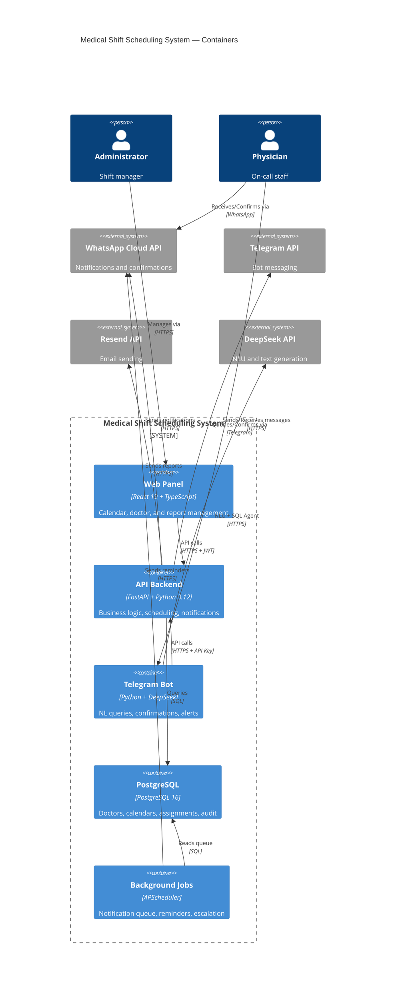

# 🏥 General Medical Services — Medical Shift Scheduling System

[](https://www.python.org/)
[](https://fastapi.tiangolo.com/)
[](https://react.dev/)
[](https://www.typescriptlang.org/)
[](https://www.postgresql.org/)
[](LICENSE)

**Institutional medical shift scheduling system** with algorithmic fairness, Telegram conversational bot, multi-channel notifications (WhatsApp + Telegram + Email), and an administrative web panel.

Originally designed for a military hospital, the system automates physician assignment to service areas (Emergency, Runway, On-Call), manages contingency missions, and maintains a complete audit trail of all actions.

---

## ✨ Features

### 🏗️ Smart Scheduling
- ✅ Automatic calendar generation with composite fairness algorithm
- ✅ Multidimensional scoring: monthly load, historical load, spacing, penalties, goal bonuses
- ✅ Week-by-week approval flow per calendar cycle
- ✅ Assisted manual assignment with candidate ranking
- ✅ Spacing rules (14-day minimum between heavy services)

### 🤖 Telegram Conversational Bot
- ✅ Hybrid architecture: LLM-first (DeepSeek) with 14 tools, deterministic fallback
- ✅ Natural language queries: *"who is on duty tomorrow in emergency?"*
- ✅ Semantic Layer with 15 predefined metrics — zero hallucination on operational data
- ✅ Multi-turn SQL Agent with self-correction (up to 3 iterations)
- ✅ Shift confirmation system via inline commands

### 📢 Multi-Channel Notifications
- ✅ WhatsApp (Meta Cloud API) for notifications and confirmations
- ✅ Telegram (notifier bot @TurnosMedicosBot + conversational bot)
- ✅ Email (Resend API) for reports and alerts
- ✅ Queue system with interchangeable providers (WhatsAppProvider, TelegramProvider, FakeProvider)
- ✅ Pre-service reminders and automatic escalation for unconfirmed shifts

### 🔐 Security and Audit
- ✅ RBAC with 12 granular permissions and 3 roles (superadmin, admin, encargado)
- ✅ Argon2 for password hashing and password history (last 5)
- ✅ Account lockout after 5 failed attempts, rate limiting on login
- ✅ Append-only audit log for all critical actions
- ✅ Security headers: CSP, X-Content-Type-Options, Referrer-Policy, Permissions-Policy
- ✅ Request ID correlation for event traceability

### 📊 Reporting
- ✅ Professional PDF (WeasyPrint + ReportLab) with Jinja2 templates
- ✅ Excel export (openpyxl)
- ✅ Calendar coverage, workload, and medical dossier reports
- ✅ Historical doctor dossier with actions and audit trail

---

## 🏗️ Architecture



**Style:** Clean Architecture with 4 layers — documented in [ADR-002](docs/adr/ADR-002-modular-monolith-design-patterns.md).

| Layer | Responsibility |
|-------|----------------|
| `api/` | FastAPI routers — HTTP concerns |
| `application/` | Use cases and orchestration |
| `domain/` | Pure business logic (no dependencies) |
| `infrastructure/` | DB, repositories, external providers |

---

## 🛠️ Tech Stack

| Layer | Technology | Version |
|-------|-----------|---------|
| **Backend** | FastAPI + Python | 3.12+ |
| **ORM** | SQLAlchemy 2 + Alembic | 2.0.36 |
| **Database** | PostgreSQL | 16 |
| **Frontend** | React + TypeScript + Vite | 19 / 6.0 / 8 |
| **State/Fetching** | @tanstack/react-query | 5 |
| **Styling** | Tailwind CSS + lucide-react | — |
| **AI / NLU** | DeepSeek (OpenAI-compatible) | — |
| **WhatsApp** | Meta Cloud API v22.0 (PyWa) | ≥3.0 |
| **Telegram** | Raw HTTP to Bot API | — |
| **Email** | Resend API | — |
| **PDF** | WeasyPrint + ReportLab | ≥68 / ≥4.2 |
| **Excel** | openpyxl | 3.1.5 |
| **Testing** | pytest + vitest + testing-library/react | — |
| **CI/CD** | GitHub Actions | — |
| **Deploy** | Railway (backend) + Vercel (frontend) + Docker | — |

---

## 🚀 Quick Start

### Prerequisites
- Docker and Docker Compose
- Node.js 22+
- Python 3.12+

### Local development

```bash
# 1. Clone
git clone <repo-url>
cd "Turnos medicos system"

# 2. Configure environment
cp .env.example .env
# Edit .env with database and API configuration

# 3. Start PostgreSQL
docker compose up -d

# 4. Backend
python3 -m venv .venv
source .venv/bin/activate
pip install -r requirements-dev.txt
uvicorn backend.app.main:app --reload

# 5. Frontend (new terminal)
cd frontend
npm install
npm run dev

# 6. Bootstrap admin account
python -m backend.app.cli reset-admin-password --email admin@example.local

# 7. Tests
./scripts/test.sh all
```

Access:
- **Backend:** `http://localhost:8000`
- **API Docs:** `http://localhost:8000/docs`
- **Frontend:** `http://localhost:5173`

---

## 📁 Project Structure

```
Turnos medicos system/
├── backend/
│   └── app/
│       ├── api/routes/        # 25 FastAPI routers
│       │   ├── auth.py
│       │   ├── calendars.py
│       │   ├── doctors.py
│       │   ├── telegram.py
│       │   └── ...
│       ├── application/       # Use cases
│       │   ├── accounts/
│       │   ├── calendars/     # CalendarEngine + GarcíaScoring
│       │   ├── doctors/
│       │   ├── missions/
│       │   ├── notifications/ # Queue + providers
│       │   ├── telegram/      # Conversational bot (32 files)
│       │   └── ...
│       ├── domain/            # Pure business logic
│       │   ├── calendars/     # Scoring, engine, types
│       │   └── doctors/       # Eligibility specs
│       └── infrastructure/    # DB, repos, email, rate limiter
│           ├── db/models/     # 14 SQLAlchemy models
│           └── repositories/  # 12 repositories
├── frontend/
│   └── src/
│       ├── features/          # Feature-based: doctors, calendars, missions...
│       ├── components/        # Shared: Sidebar, AuthGuard, Toast
│       ├── api/               # 14 API modules
│       └── context/           # AuthContext
├── docs/
│   ├── specs/                 # 15 specifications
│   ├── adr/                   # Architecture Decision Records
│   └── ARCHITECTURE.md
├── docker-compose.yml
├── Dockerfile
├── railway.json
└── .github/workflows/ci.yml
```

---

## 📊 Main API Endpoints

| Method | Path | Description | Auth |
|--------|------|-------------|------|
| POST | `/api/auth/login` | Sign in | Public |
| POST | `/api/auth/change-password` | Change password | JWT |
| GET | `/api/calendars` | List calendars | JWT |
| POST | `/api/calendars/generate` | Generate calendar automatically | Admin |
| GET | `/api/doctors` | List doctors | JWT |
| GET | `/api/doctors/{id}/availability` | Doctor availability | JWT |
| POST | `/api/missions/rank` | Rank mission candidates | JWT |
| POST | `/api/telegram/webhook` | Telegram bot webhook | Signature |
| POST | `/api/webhooks/whatsapp` | WhatsApp webhook | Signature |
| GET | `/api/notifications` | Notification log | JWT |
| GET | `/api/reports/coverage` | Coverage report | Admin |
| GET | `/api/audit` | Audit log | Admin |

---

## 🧪 Testing

| Type | Framework | Command |
|------|-----------|---------|
| Backend unit | pytest | `./scripts/test.sh unit` |
| Backend integration | pytest (PostgreSQL) | `./scripts/test.sh all` |
| Specific phase | pytest | `./scripts/test.sh phase 0` |
| Frontend | vitest | `cd frontend && npm test` |

**Coverage:** ~100+ backend tests, 20 frontend tests. Integration tests require PostgreSQL and are marked with `@pytest.mark.integration`.

---

## 🔐 Security

- **JWT** with HS256, audience and issuer validation
- **Argon2** for password hashing
- **Rate limiting** on login (20 req/15 min per IP)
- **Account lockout** after 5 failed attempts
- **Password history** (last 5 passwords blocked)
- **Security headers:** CSP, X-Content-Type-Options, Referrer-Policy, Permissions-Policy
- **Request ID** correlation for event traceability
- **Middleware stack:** UnhandledException → CORS → SecurityHeaders → RequestID → RequestLogging

---

## 📄 License

MIT © Hendrick Rafael 2026
