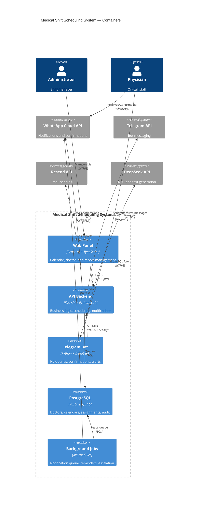
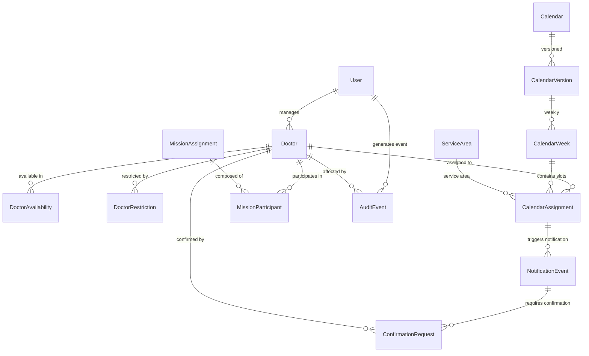

# 🏗️ Architecture: General Medical Services — Medical Shift Scheduling System

## C4 Diagram — Container Level



---

## Architectural Style

**Clean Architecture with 4 layers** — documented in [ADR-002](adr/ADR-002-modular-monolith-design-patterns.md).

```
api/              ← Interface Adapters: FastAPI routers, request/response schemas
application/      ← Use Cases: calendar, notification, and Telegram bot services
domain/           ← Enterprise Rules: fairness scoring, eligibility, domain types
infrastructure/   ← DB models, repositories, email, rate limiter, circuit breaker
```

**Core principle:** Dependencies point inward. `domain/` is pure Python — it knows nothing about FastAPI, SQLAlchemy, or any framework. `infrastructure/` implements interfaces defined in `application/`. `api/` only translates HTTP into application calls.

---

## Design Patterns

| Pattern | Location | Purpose |
|---------|----------|---------|
| **Repository** | `infrastructure/repositories/` (12 repos) | Persistence abstraction |
| **Strategy** | `domain/calendars/scoring.py` | Composite scoring algorithm (configurable weights) |
| **Specification** | `domain/doctors/eligibility.py` | 5 composable eligibility rules |
| **Provider** | `application/notifications/providers.py` | Swappable notification backends |
| **Circuit Breaker** | `infrastructure/circuit_breaker.py` | Resilience against external API failures |
| **Tool-calling Gateway** | `application/telegram/tool_registry.py` | 14 tools with JSON schemas for LLM dispatch |
| **Factory** | `api/routes/calendars.py` (deps) | Per-route dependency wiring |
| **Scoring Pipeline** | `domain/calendars/engine.py` + `scoring.py` | Candidate ranking with rationale |
| **Outbox / DB-backed Jobs** | `application/notifications/` + `scheduler/` | Notification queue without Redis |
| **Append-only Audit Log** | `application/audit/` | Traceability for critical actions |

---

## Main Data Flows

### Calendar Generation

```
Administrator → [POST /api/calendars/generate]
  → CalendarService.generate_calendar()
    → CalendarEngine.build()
      → Sort slots by constraint level (most constrained first)
      → For each slot:
        → EligibilityChecker.filter(doctors, slot)
        → ScoringPipeline.score(candidates)
          → compute_candidate_score():
            = 100 - monthly_load*10 - historical_load*3
              + days_since_last*0.5 + days_since_heavy*0.3
              - warnings*5 + goal_bonus - area_penalty
        → Pick best → assign → CalendarAssignment
      → Identify unresolved gaps → UnresolvedGap
    → Persist CalendarVersion + CalendarWeek + CalendarAssignment
  → Return GenerationSummary
```

### Telegram Bot Query Flow

```
Physician → [Telegram: "who is on duty Monday in emergency?"]
  → POST /api/telegram/webhook → TelegramOrchestrator
    → ConversationalAgent.process()
      → PATH 1 (LLM-First):
        → NLUEngine.classify() → DeepSeek → Intent: QUERY_ONCALL
        → ToolRegistry.dispatch("query_oncall_doctor")
        → DoctorQueryService.execute() → deterministic SQL (no LLM)
        → generate_response() → DeepSeek formats friendly response
      → PATH 2 (Legacy, if LLM unavailable):
        → EntityResolver.pre_process() → IntentClassifier → if-elif
    → MemoryManager.save(context, 30min TTL)
  → Physician receives: "Monday the 30th, Dr. García is on duty in Emergency (07:00-19:00)"
```

---

## Simplified Data Model



---

## Key Decisions

| Decision | ADR | Summary |
|----------|-----|---------|
| Tech stack | [ADR-001](adr/ADR-001-architecture-baseline.md) | FastAPI + PostgreSQL + React + Vite |
| Architectural style | [ADR-002](adr/ADR-002-modular-monolith-design-patterns.md) | Modular Monolith + Clean Architecture |
| Scheduling algorithm | [ADR-003](adr/ADR-003-greedy-scoring-vs-or-tools.md) | Greedy Scoring over OR-Tools CP-SAT |
